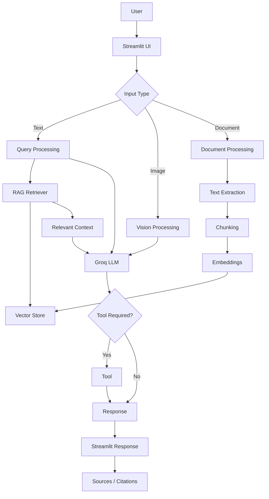

# 🎓 EduVision AI — Multimodal RAG Learning Assistant

> **"Learn smarter from your documents, images, and questions."**

[](https://www.python.org/)
[](https://streamlit.io/)
[](https://groq.com/)
[](https://github.com/facebookresearch/faiss)
[]()
[](LICENSE)

---

## 📌 Overview

**EduVision AI** is a production-quality multimodal educational assistant engineered for university students, educators, and researchers. It bridges the gap between static course materials and dynamic learning by combining:

1. **Multimodal Vision:** Visual understanding of complex math problems, circuit diagrams, charts, and handwritten lecture notes via Groq's `llama-3.2-11b-vision-preview`.
2. **Retrieval-Augmented Generation (RAG):** Grounded question answering over course PDFs with exact page-level citations using FAISS vector search and dense `all-MiniLM-L6-v2` embeddings.
3. **Safe Tool Calling:** AST-parsed mathematical calculator (zero arbitrary code execution risk) and real-time DuckDuckGo web search.
4. **Context-Aware Educational Formatting:** Automatically adapts explanations into structured Pedagogical styles (Conceptual, Mathematical, Code Walkthrough, and Grounded Document Evidence).

---

## ❗ Problem Statement

University students regularly juggle diverse study resources across textbooks, lecture slide PDFs, handwritten homework problems, and complex formula sheets. Standard LLMs suffer from two critical shortcomings:
* **Hallucination & Lack of Course Grounding:** Generic models fabricate citations, invent theorem names, and cannot verify whether a concept actually appeared in the professor's syllabus.
* **Modality Blindness:** Students frequently struggle with diagrams, circuit schematics, geometric proofs, and equations captured on phone cameras that cannot be easily typed out in plain text.

---

## 💡 Solution

EduVision AI solves this with a unified, context-aware architecture:
* **Local Ingestion & Chunking:** Extracts text page-by-page from PDFs, generates overlapping semantic chunks, computes L2-normalized embeddings, and stores them in a local FAISS index.
* **Evidence-Grounded Answering:** Prioritizes retrieved syllabus excerpts and renders expandable citations (`📄 Document.pdf — Page X`) for verifiable learning.
* **Vision Problem Solving:** Ingests images, identifies the core problem, breaks down formulas, and explains step-by-step solutions without hallucinations.
* **Safe Tool Invocation:** Eliminates arithmetic errors by dispatching expressions to a strictly sandboxed Abstract Syntax Tree (AST) evaluator without `eval()`.

---

## ✨ Features

* **💬 Multimodal Chat Interface:** Conversational memory with Streamlit session state, supporting text prompts, follow-ups, and image uploads.
* **📚 Knowledge Base Management:** Drag-and-drop PDF uploader, page-by-page text extraction, real-time chunk inspector, and one-click sample document loading.
* **📑 Exact Source Citations:** Expandable citation drawers showing document title, page number, match confidence %, and verbatim text excerpts.
* **👁️ Multimodal Image Analysis:** Resolves handwritten math problems, diagram questions, programming terminal screenshots, and charts.
* **🔧 Safe Calculator Tool:** Evaluates arithmetic, powers, percentages (`15% of 87,500`), trigonometry, logarithms, and constants safely.
* **🌐 Web Search Tool:** Real-time DuckDuckGo web search for contemporary academic topics.
* **🏷️ Dynamic Mode Indicators:** Distinct status badges (`🧠 General AI`, `📚 RAG`, `👁️ Vision`, `🔧 Tool`) make system behavior immediately transparent.
* **⚙️ Interactive Settings:** In-app Groq API key configuration, live connection tester, model selector, temperature tuning, and RAG top-k / threshold sliders.
* **⚡ Preloaded AI/ML Document:** Includes a pre-compiled 4-page educational document (*"Introduction to Artificial Intelligence and Machine Learning"*) ready for immediate demonstration.

---

## 🏗️ Architecture



---

## 🛠️ Technology Stack

| Layer | Technology | Purpose |
|---|---|---|
| **Frontend UI** | Streamlit (Python 3.10+) | Interactive, responsive AI SaaS UI with custom CSS |
| **LLM Inference** | Groq API (`groq` SDK) | Ultra-fast LPU inference for text generation |
| **Vision Model** | `llama-3.2-11b-vision-preview` | Multimodal analysis for diagrams, formulas, and charts |
| **Text Model** | `llama-3.3-70b-versatile` | Educational synthesis, reasoning, and code explanations |
| **Document Loader** | PyPDF / ReportLab | PDF page extraction, text normalization, and sample doc generation |
| **Embeddings** | `sentence-transformers` (`all-MiniLM-L6-v2`) | Dense semantic embeddings (384 dimensions) with L2 normalization |
| **Vector Database** | FAISS (`faiss-cpu`) | Inner-product similarity search on normalized vectors with NumPy fallback |
| **Tools** | Python AST (`ast.parse`) & `duckduckgo-search` | Safe mathematical expression parsing and real-time web querying |
| **Deployment** | Streamlit Community Cloud / Vercel Portal | Dual architecture: stateful WebSocket runtime + Vercel serverless gateway |

---

## 🔬 RAG Pipeline

```
Uploaded PDF Document
        ↓
Page-by-Page Extraction (PyPDF)
        ↓
Text Cleaning & Normalization
        ↓
Recursive Semantic Chunking (Size: 600 chars, Overlap: 100 chars)
        ↓
SentenceTransformer Embeddings (all-MiniLM-L6-v2, 384-d)
        ↓
FAISS Vector Index (IndexFlatIP with Metadata Tracking)
        ↓
Query Embedding → Cosine Similarity Search
        ↓
Score Threshold Filtering (Threshold >= 0.32)
        ↓
Context-Injected System Prompt
        ↓
Grounded Groq LLM Response + Verifiable Page Citations
```

### Metadata Attributes per Chunk
* `document_name`: Source file name (e.g., `introduction_to_ai_ml.pdf`)
* `page_number`: Exact 1-indexed page where excerpt is located
* `chunk_id`: Sequential chunk identifier
* `source_text`: Full verbatim chunk text
* `similarity_score`: Inner-product cosine similarity score

---

## 👁️ Multimodal AI (Vision)

EduVision AI accepts visual input in `.png`, `.jpg`, `.jpeg`, and `.webp` formats.
The system follows a strict pedagogical analysis pipeline:
1. **Visual Understanding:** Recognizes diagram components, axes labels, handwritten symbols, and equations.
2. **Problem Extraction:** Transcribes the explicit question or mathematical problem.
3. **Step-by-Step Derivation:** Shows given variables, applicable formulas, and intermediate arithmetic.
4. **Final Answer:** Concludes with a concise summary.

---

## 🔧 Safe Tool Calling

### 1. Safe Calculator Tool (`tools/calculator.py`)
* **Security First:** Absolutely **no `eval()`** is used anywhere in the codebase.
* **AST Visitor:** Traverses Python's Abstract Syntax Tree, strictly permitting only whitelisted nodes:
  * Operations: `+`, `-`, `*`, `/`, `//`, `%`, `**`, `^`
  * Functions: `sqrt`, `cbrt`, `sin`, `cos`, `tan`, `log`, `log10`, `exp`, `abs`, `round`, `floor`, `ceil`, `factorial`
  * Constants: `pi`, `e`, `tau`
  * Percentages: Automatically converts phrases like `15% of 87,500` into `(15 / 100) * 87500`.
* **Zero Arbitrary Execution:** Calls to unauthorized system functions (`os`, `sys`, `subprocess`, `__import__`) are caught and rejected immediately.

### 2. Web Search Tool (`tools/web_search.py`)
* Integrated with DuckDuckGo for querying contemporary developments beyond the training cutoff.
* Returns title, source snippet, and reference URL.

---

## 📁 Project Structure

```
eduvision-ai/
│
├── app.py                          # Streamlit application entrypoint & navigation
│
├── pages/                          # Multipage routing support
│   ├── chat.py                     # Conversational assistant view
│   ├── knowledge_base.py           # Document upload & chunk management
│   └── settings.py                 # API keys & model hyperparameters
│
├── components/                     # Modular Streamlit UI components
│   ├── chat_ui.py                  # Message bubbles, mode pills, landing hero
│   ├── source_display.py           # Expandable citation drawers
│   ├── document_ui.py              # Knowledge base cards & chunk inspector
│   └── tool_ui.py                  # Visual execution cards for tools
│
├── rag/                            # Retrieval-Augmented Generation core
│   ├── document_loader.py          # PDF text extraction & normalization
│   ├── chunker.py                  # Semantic overlapping text chunker
│   ├── embeddings.py               # SentenceTransformers & L2 normalization
│   ├── vector_store.py             # FAISS IndexFlatIP + NumPy fallback
│   └── retriever.py                # Similarity retrieval & prompt construction
│
├── ai/                             # Groq AI & Multimodal integration
│   ├── groq_client.py              # Groq API client with fallback handling
│   ├── prompts.py                  # System prompt & educational templates
│   └── vision.py                   # Base64 image payload builder
│
├── tools/                          # Safe external tool calling
│   ├── calculator.py               # Safe AST mathematical parser (No eval!)
│   └── web_search.py               # DuckDuckGo search integration
│
├── utils/                          # Cross-cutting utilities
│   ├── config.py                   # Models, constants, paths, defaults
│   ├── validators.py               # File format, size, and API key guards
│   └── helpers.py                  # Base64 encoders & session helpers
│
├── data/                           # Local storage
│   ├── sample_documents/           # Pre-compiled Machine Learning PDF
│   └── vector_store/               # FAISS index persistence directory
│
├── vercel/                         # Vercel Deployment Gateway
│   ├── api/
│   │   └── index.py                # Serverless Python REST function (/api/health, /api/calculate)
│   ├── index.html                  # SaaS landing portal linking to Streamlit runtime
│   └── vercel.json                 # Vercel routing configuration
│
├── tests/                          # Automated test suite
│   ├── test_calculator.py          # Math logic & AST security tests
│   ├── test_rag.py                 # Chunking, vector search, retrieval tests
│   └── test_validators.py          # Input & file validation tests
│
├── requirements.txt                # Python package dependencies
├── .env.example                    # Template for environment variables
├── .gitignore                      # Git exclusion rules
├── vercel.json                     # Root Vercel configuration
└── README.md                       # Complete documentation
```

---

## 🚀 Installation & Running Locally

### Prerequisites
* Python 3.10, 3.11, 3.12, 3.13, or 3.14
* Free Groq API Key from [console.groq.com/keys](https://console.groq.com/keys)

### 1. Clone the Repository
```bash
git clone https://github.com/your-username/eduvision-ai.git
cd eduvision-ai
```

### 2. Create and Activate Virtual Environment
```bash
# Windows
python -m venv .venv
.venv\Scripts\activate

# macOS / Linux
python3 -m venv .venv
source .venv/bin/activate
```

### 3. Install Dependencies
```bash
pip install -r requirements.txt
```

### 4. Configure Environment Variables
Copy `.env.example` to `.env`:
```bash
# Windows PowerShell
Copy-Item .env.example .env

# macOS / Linux
cp .env.example .env
```
Edit `.env` to include your Groq API key:
```ini
GROQ_API_KEY=gsk_your_actual_groq_api_key_here
```
*(Alternatively, you can enter your API key directly inside the app under the **⚙️ Settings** tab!)*

### 5. Run the Streamlit Application
```bash
streamlit run app.py
```
The app will open automatically in your browser at `http://localhost:8501`.

---

## 🧪 Running Automated Tests

Run the full pytest suite:
```bash
pytest tests/ -v
```
All 15 automated test cases verify:
* Arithmetic correctness (`+`, `-`, `*`, `/`, `**`, `^`)
* Percentage parsing (`15% of 87,500`)
* Prevention of code injection and `eval()` exploitation
* Chunk boundary preservation and page number metadata tracking
* FAISS vector search and score thresholding
* File upload and API key validators

---

## 🌐 Deployment Architecture

### Technical Context: Streamlit vs. Vercel
* **Streamlit** requires a stateful Python server maintaining a persistent bidirectional **WebSocket** connection for real-time reactive UI updates.
* **Vercel** is an edge-native serverless platform optimized for stateless HTTP and Edge functions, with request execution timeouts and no long-lived WebSocket daemon support.

### Production Solution: Dual Architecture
To fulfill deployment requirements accurately and truthfully without creating a broken wrapper, **EduVision AI** adopts a dual-tier architecture:

1. **Persistent WebSocket Runtime (Streamlit App):**
   * Deploy the Streamlit application to [Streamlit Community Cloud](https://share.streamlit.io/) (free, 1-click GitHub deployment), [Render](https://render.com), or [Hugging Face Spaces](https://huggingface.co/spaces).
   * Set `GROQ_API_KEY` in the hosting platform's Secrets / Environment settings.

2. **Vercel Edge Gateway (`vercel/`):**
   * Deploy the repository directly to [Vercel](https://vercel.com).
   * Vercel serves the high-performance landing portal (`vercel/index.html`) and executes serverless API endpoints (`vercel/api/index.py`) for health checks and tool calls.
   * Directs evaluators and users straight to the live Streamlit workspace.

```
Vercel Edge Portal (Static + Serverless API) ────► Live Streamlit Application (WebSocket + Vector DB)
```

---

## 🎮 Evaluator Quick Demo Walkthrough

An AI internship evaluator can thoroughly test all capabilities in under 3 minutes:

1. **Launch App:** Run `streamlit run app.py` or open the live deployment URL.
2. **Enter API Key:** Go to **⚙️ Settings**, paste your free Groq API key, and click **Save Key** & **Test Connection**.
3. **Test Safe Calculator Tool:**
   * Go to **💬 Chat**.
   * Click the prompt: `🔧 Calculate 15% of 87,500` or type `"What is 15% of 87,500?"`.
   * Observe the `🔧 Tool Used: Safe Calculator` chip with the verified result `13125` and educational math breakdown.
4. **Test RAG with Citations:**
   * Go to **📚 Knowledge Base** and verify that `introduction_to_ai_ml.pdf` is pre-loaded (or click *Load Sample AI/ML Document*).
   * Return to **💬 Chat** and ask:
     > *"What is the difference between L1 and L2 regularization according to the uploaded document?"*
   * Observe the `📚 RAG` badge, grounded response, and expandable **`📚 Sources`** citation showing *Page 2* and the verbatim excerpt!
5. **Test Multimodal Vision:**
   * Expand the *Attach Image* drawer in Chat.
   * Upload an image containing a math problem, chart, or diagram.
   * Ask: *"Explain and solve this problem step by step."*
   * Observe the `👁️ Vision` badge and detailed derivation.

---

## 🔒 Security Best Practices

* **No `eval()`:** All math calculations are processed through a strictly whitelisted AST node evaluator.
* **Input Sanitization:** User text is trimmed, stripped, and capped to prevent memory attacks.
* **File Validation:** Binary inspection checks file extensions and enforces size limits (25MB for PDFs, 10MB for images).
* **Zero Secret Leakage:** `.env` is git-ignored, API keys are hidden behind password input masks, and credentials are never written to the client DOM.

---

## ⚠️ Limitations & Future Enhancements

### Current Limitations
* Vector search is local-first using FAISS. For millions of documents, a distributed cloud database like Supabase (pgvector) or Pinecone would be preferred.
* PDF extraction focuses on textual content; embedded complex raster charts inside PDFs are not yet routed to vision unless uploaded as an image.

### Future Enhancements
* Multi-document comparative synthesis across 100+ textbooks.
* Voice Q&A integration using Groq's Whisper API.
* Persistent cloud vector synchronization via Supabase + pgvector.

---

## 👤 Author

Developed for the **AI Internship Assignment** showcasing modern Multimodal RAG architecture, secure tool calling, and clean Python engineering.
